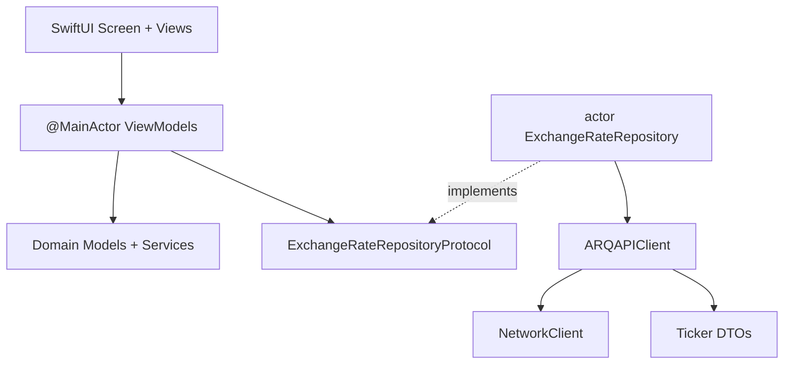
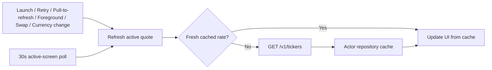

# ARQExchange

ARQExchange is a native iOS currency exchange calculator for USDc and supported quote currencies. It fetches indicative ask/bid rates from the DolarApp API, supports bidirectional amount entry, currency selection, swapping, retry/error states, and deterministic tests.

The app is intentionally small, but it is structured like production mobile code: clear layers, dependency injection, test doubles, lifecycle-aware refresh work, and user-facing error handling.

## Requirements Coverage

| Requirement | Status | Notes |
|-------------|--------|-------|
| Two linked currency fields | Implemented | Users can enter either USDc or the selected quote currency |
| Automatic conversion | Implemented | Active input drives the opposite field using ask/bid semantics |
| Currency picker | Implemented | Bottom sheet for supported quote currencies |
| Swap button | Implemented | Swaps positions and preserves entered value |
| Live exchange rates | Implemented | Uses `GET /v1/tickers?currencies=<quote>` |
| Unavailable currency catalog API | Handled | Local catalog keeps the app functional; API client has a ready endpoint |
| Error handling | Implemented | Full-screen retry on initial failure; inline refresh warning when cached data exists |
| Tests | Implemented | Unit tests and UI tests use deterministic mocks |

## Quick Start

### Prerequisites

- Xcode 16+
- iOS 17+ simulator or device

### Run

```bash
open ARQExchange.xcodeproj
```

Select the `ARQExchange` scheme, choose any available iOS simulator, and run the app.

### Test

From Xcode, select the `ARQExchange` scheme and run the test plan.

From the command line, first confirm an available destination:

```bash
xcodebuild -scheme ARQExchange -showdestinations
```

Then run tests with one of the listed simulator destinations:

```bash
xcodebuild test \
  -scheme ARQExchange \
  -destination 'platform=iOS Simulator,name=<Simulator Name>'
```

UI tests run against mock data through the `-UITestingMockData` launch argument, so they do not depend on the live API.

## Screenshots And Recording

### Short screen recording of typing, selecting a currency, and swapping currencies


<hr></hr>

### Screenshots
<p align="center">
    
    
    
    
</p>

## Architecture

The project follows a pragmatic layered structure:

```text
ARQExchange/
├── Application/                 App entry point and dependency composition
├── Core/
│   ├── API/                     HTTP client, endpoint construction, API errors
│   └── Theme/                   Shared colors and typography
├── Domain/
│   ├── API/                     API protocol boundary
│   ├── Models/                  Currency, exchange rate, amount-field models
│   ├── Repositories/            Repository contract
│   └── Services/                Pure conversion and freshness formatting logic
├── Data/
│   ├── DTOs/                    API response decoding
│   └── Repositories/            Actor-backed repository and mock repository
├── Features/ExchangeCalculator/
│   ├── Screens/                 Screen composition
│   ├── ViewModels/              Screen state and user action orchestration
│   └── Views/                   Reusable SwiftUI components
└── PreviewContent/              SwiftUI preview support
```

Dependency direction is kept simple:

- SwiftUI views depend on ViewModels.
- ViewModels depend on domain services and repository protocols.
- The data layer implements repository protocols and talks to the API client.
- Domain models and services do not import SwiftUI or networking code.



`AppDependencies` is the composition root. It wires the production repository for normal app launches and mock data for UI tests.

## Implementation Notes

### Rates

- The live endpoint is `GET /v1/tickers?currencies=<quote>`.
- The app applies `ask` for USDc to quote conversion.
- The app applies `bid` for quote to USDc conversion.
- Rates are presented as indicative calculator values, not guaranteed execution prices.

### Refresh Transport Decision

The assignment exposes a REST ticker endpoint, so the app uses lifecycle-aware HTTP polling instead of a streaming transport.

| Option | Fit | Decision |
|--------|-----|----------|
| HTTP polling | Works with the provided REST API, simple to cache, easy to test, safe for a small calculator | Used |
| WebSocket | Useful for sub-second market data, but no WebSocket endpoint is provided | Not applicable |
| Server-sent events / push | Requires backend support and adds lifecycle complexity | Not applicable |
| Fetch only on user action | Lowest network usage, but stale while the user leaves the screen open | Not enough by itself |



### Currency Catalog

The brief states that `GET /v1/tickers-currencies` is not available yet. To keep the app fully functional, `SupportedCurrencies` provides a local catalog for MXN, ARS, BRL, and COP.

`ARQAPIClient` already includes a `fetchTickerCurrencies()` method, so switching to the live catalog later should be limited to repository/bootstrap wiring rather than conversion or UI logic.

### Refresh Behavior

- Initial load, retry, pull-to-refresh, foreground resume, swap, and currency selection can force a refresh.
- Automatic polling is lifecycle-aware and runs only while the calculator screen is active.
- The repository is an `actor`, which protects the rate cache and coalesces overlapping refreshes.
- If a refresh fails while cached data exists, the app keeps the last rate visible and shows an inline warning.
- If the initial load fails and there is no cached rate, the app shows a full-screen error view with a retry button.

### Money Input

- Amounts are stored as minor units to avoid floating-point input drift.
- Formatting is currency-aware.
- Per-currency maximums protect against unrealistic or overflowing calculator values.
- Coupled limits reject input when the converted opposite amount would exceed its allowed maximum.

## Testing

Unit tests use Swift Testing and avoid live network calls.

| Suite | Focus |
|-------|-------|
| `MoneyInputViewModelTests` | Minor units, formatting, maximums, rejected input |
| `CurrencyConversionTests` | Ask/bid math and rate descriptions |
| `ExchangeRateRepositoryTests` | Cache TTL, request coalescing, cancellation |
| `ExchangeCalculatorViewModelTests` | Swap, picker changes, refresh races, limits |
| `ExchangeCalculatorReliabilityTests` | Refresh overflow and failure messaging |
| `ARQAPITests` | URL construction, decoding, API error mapping |

UI tests use XCTest and `MockExchangeRateRepository` through `-UITestingMockData`.

## Accessibility

The main interactive and asserted UI elements have accessibility identifiers, including:

`appReady`, `rateDescription`, `rateFreshnessLabel`, `currencyInputCard`, `topInputRow`, `bottomInputRow`, `swapButton`, `currencyPickerSheet`, `amountLimitWarning`, `refreshFailureMessage`, `errorMessage`, and `retryButton`.

## Tradeoffs And Next Steps

- Wire `GET /v1/tickers-currencies` when the endpoint becomes available, while keeping the local catalog as fallback.
- Add a disk cache for last-known rates if offline read-only behavior becomes a product requirement.
- Add CI for build, unit tests, and UI tests on pull requests.
- Consider a streaming transport only if the API and product requirements move beyond indicative calculator rates.
